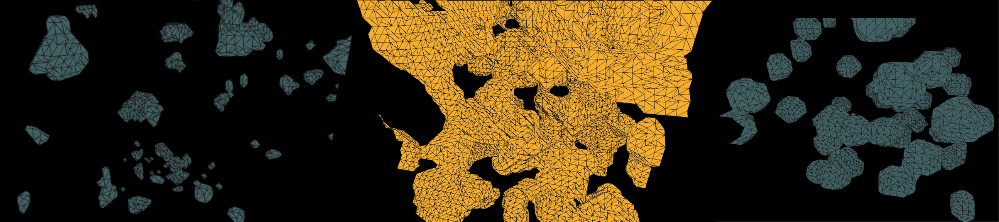
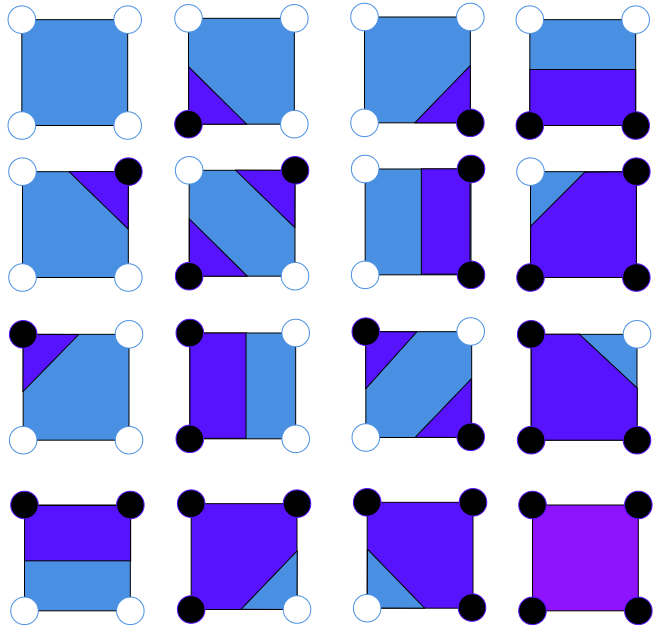
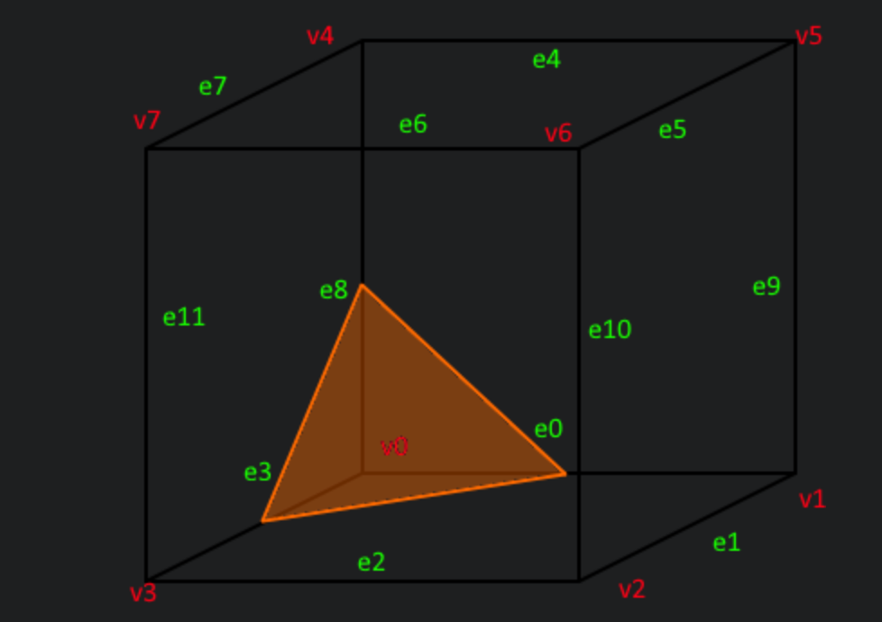
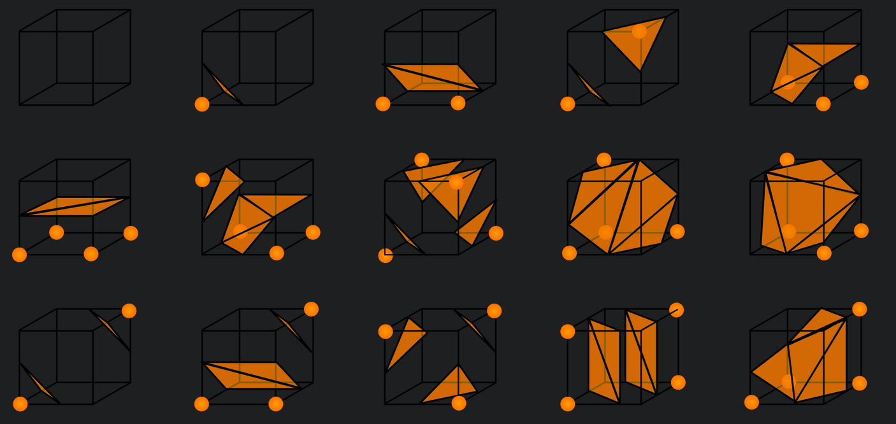

# 3D Noise Visualization With Marching Cube Algorithm

## Abstract
3D visualizations of different noises using the marching cubes algorithm. Those ones are animated by varying the iso-surface value with time. The final result can be watched on [Vimeo](https://vimeo.com/808352034).

## Introduction
As an art and image technology students, we are used to using 2D noise textures, especially in a realistic / organic artistic approach to represent the complexity of the world around us. After watching a video by Daniel Shiffman about the square marching algorithm, I was curious to represent these noises in a three dimensional space, images that I could not find, especially on the Internet. To achieve this goal, I combined the cube marching algorithm with the most commonly used noise algorithms (Perlin,Worley, Simplex), in a Processing programming context.

## Algorithm Explanation
Before explaining the 3D cube marching algorithm, I think it would be better to explain the 2D square marching algorithmwhich is easier to mentally imagine.

### Square Marching Algorithm
The Marching Squares algorithm is a computer graphics algorithm introduced in the 1980s that can be used to create a contour map or isoline of a 2D scalar field. The algorithm works by dividing the scalar field into a grid of square cells, where each cell is defined by its four corner points. The we iterate through the grid to determine the vertex state in comparison to an iso-value 𝜎. Each grid vertex is now assigned a binary state (0 or 1).

The configuration of each sub-grid is matched with one entry in the contours lookup table below.

Vertex Patterns (2D)          |  
:-------------------------:   |
 |

We think of the dark blue region as the interior of an object, and the light blue region as the exterior of the object. We denote the 𝑂𝑁 (1) state by a black vertex and the 𝑂𝐹𝐹 (0) state by a white vertex. Thus, the configuration 7 = (0111)2 must correspond to an object whose contour intersects the top and left edges of the square. In this fashion, the contours in each sub-grid are approximated.

### Cube Marching Algorithm
The main difference between the square marching algorithm and the cube marching algorithm is that the former operates in 2D space while the latter operates in 3D space. The Square marching algorithm is a 2D method that generates contour maps, while the cube marching algorithm is a 3D method that generates contour surfaces. Both algorithms use similar techniques to identify the location of the contours and generate intersection points, but they operate in different dimensional spaces.

For example, if vertex 𝑣0 where to be of value −1.0, and all other vertices have a value of 1.0. Given that our iso-surface is 0.5, we can conclude that since vertex 𝑣0 is the only vertex below the threshold, we want to hide this vertex by creating a triangle in front of it by connecting edges 0, 3 and 8.
In total there are 256 such combinations that can be formed by looking at the values of our vertices since cubes have 8 corners with each 2 possible states (28 = 256). These 256 configurations can be reduced to only 15, since most cases are symmetries.

One Cube                       |  Vertex Patterns
:-------------------------:|:-------------------------:
  |  

Once we have determined the configuration for a single cube and placed our triangles, we move on to the next andrepeat the same process for all other cubes in the world.

## Noise implementation
To incorporate noise into the cube marching algorithm, we can use a noise function to compute the scalar values at each vertex of the cube.

### Perlin Noise
Perlin noise is a type of gradient noise, which is a family of noise functions that use gradients to create natural-looking
random patterns. The resulting Perlin noise function is smooth and continuous, and has a natural-looking pattern that resembles natural phenomena like clouds, terrain, and fire. The algorithm is highly customizable and can be used to generate a wide range of patterns with different scales and levels of detail.

### Simplex Noise
Simplex noise is a type of gradient noise that was developed by Ken Perlin as an improvement over his original Perlin
noise algorithm. The resulting noise function is smooth and continuous, and has similar natural-looking properties as Perlin noise. However, simplex noise has some advantages over Perlin noise, such as better computational efficiency and improved visual quality for higher dimensions.

### Worley Noise
Worley noise, also known as cellular noise or Voronoi noise, is a type of noise function that creates a pattern of cells, each
with a unique value. We first generate a set of random points distributed throughout the space. then for each point in the space, we find the closest feature point. We compute the distance between the point and its closest feature point and finally we apply a distance function to the distances to get the
final Worley noise value for the point. Worley noise can be used for a variety of applications, such as creating textures, generating terrain, and modeling natural phenomena like cracks and veins.

## Improvements

One way to improve the smoothness and accuracy of the resulting mesh is to use interpolation techniques to estimate the position and normal vectors of the vertices on the isosurface. To implement interpolation with the cube marching algorithm, we can modify the lookup table used to generate the polygonal mesh. Instead of using a fixed set of intersection points between the cube edges and the isosurface, we can use the interpolated positions and scalar values to compute more accurate and smooth surfaces.

